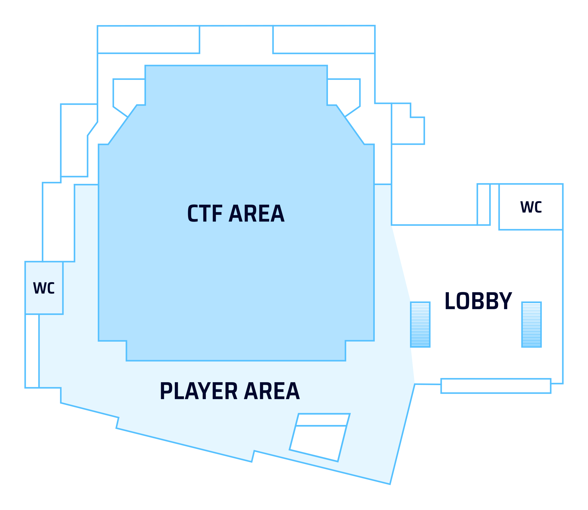
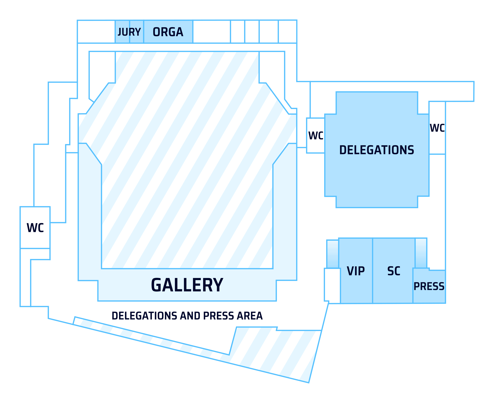

An overview of the important locations for this year’s ECSC can be found in [this interactive map](https://umap.openstreetmap.fr/en/map/ecsc-2026-important-locations_1424558).

## 3.1 Opening Ceremony and CTF

The opening ceremony on Monday and the CTF events on Tuesday through Thursday as well as the final Steering Committee meeting on Friday will take place in **RuhrCongress Bochum**.

To get to RuhrCongress by public transportation, take bus 354 to *RuhrCongress*, or tram lines 308, 316, or 318 to *Planetarium* or *Vonovia RuhrStadion*.

An on-site paid parking garage is available.

:::success
RuhrCongress Bochum

Stadionring 20

44791 Bochum

:::

The room plans in the sections below are preliminary and subject to change.

### 3.1.1 Competition Area

The opening ceremony and the CTF events will take place in the Great Hall (*Großer Saal*) of RuhrCongress Bochum. You can enter the Great Hall by turning left in the foyer.

The player area outside of the Great Hall is reserved for players during the CTF, and includes a break area for players wishing to take a break during the CTF.

 

### 3.1.2 Delegation Area

Delegations and other guests are generally not allowed to enter the playing area during the CTF events. Instead, we have reserved the *Congress Saal* on the top floor of RuhrCongress Bochum for you. Two sets of stairs lead from the foyer to the upstairs delegation area.

Steering Committee meetings and press work take place in the meeting rooms opposite the delegation room.

 

### 3.1.3 Other Areas

Some areas of the venue are reserved for the organizing team and the jury. The backstage and delivery area downstairs is generally off-limits to visitors.

For those who need it, we try to offer a quiet space backstage. Please approach an angel or watchdog for more information.

Venue and catering staff and the organizing team have access to all areas at all times.

Accessible toilets are located in the basement; an elevator is available.

### 3.2.3 Branded materials

We don't allow team or sponsor banners and flags to be displayed permanently at the team tables, as they could be mistaken for official ECSC sponsorship. Branded personal items such as team shirts, hoodies and laptop stickers are fine. You’re also welcome to use a banner or flag for team photos, as long as it isn't left on display.

## 3.2 Closing Ceremony and Afterparty

The closing ceremony and afterparty on Friday will take place in the **Jahrhunderthalle Bochum**.

To get to Jahrhunderthalle by public transportation, take tram lines 302, 305, or 310 to either *Jacob-Mayer-Straße/Jahrhunderthalle* or *Bochumer Verein/Jahrhunderthalle.*

Persons with reduced mobility may want to consider taking tram 302 to *Westpark*, which avoids the incline from Alleestraße to Jahrhunderthalle.

You can also find a paid parking garage nearby.

:::success
Jahrhunderthalle Bochum

An der Jahrhunderthalle 1

44793 Bochum

:::

## 3.3 Hotels

In case of emergency, make sure you know where your hotel is. If you booked your hotel through the shared booking portal, here is a list of addresses:

| Hotel | Address | Near to |
|-------|---------|---------|
| Moxy Bochum | Stadionring 18, 44791 Bochum | RuhrCongress, Starlight Express |
| Best Western Hotel Bochum | Stadionring 22, 44791 Bochum | RuhrCongress, Starlight Express |
| Garner Hotel Bochum | Nordring 44-50, 44787 Bochum | Bergbaumuseum |
| B&B Hotel Bochum Hbf Nord | Kurt-Schumacher-Platz 13-15, 44787 Bochum | Bochum Hbf (central station) |
| B&B Hotel Bochum Hbf Süd | Universitätsstraße 3, 44789 Bochum | Bochum Hbf (central station) |
| B&B Hotel Bochum City | Alleestraße 30-32, 44793 Bochum | Bochum West station |
| Achat Hotel Bochum Dortmund | Kohlleppelsweg 45, 44791 Bochum | Ruhr Park shopping mall |