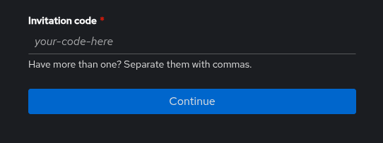
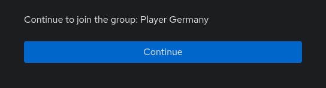
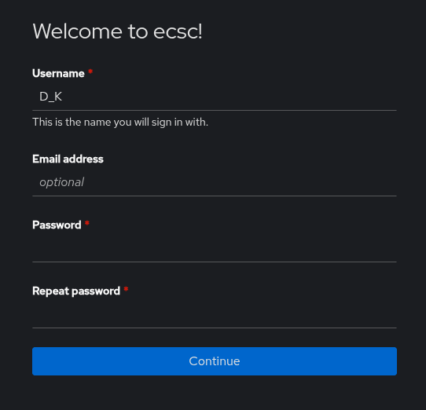
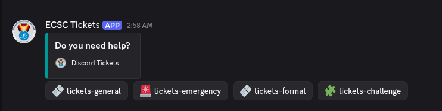
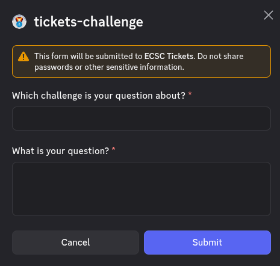
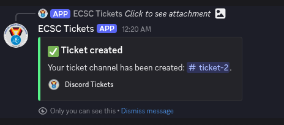
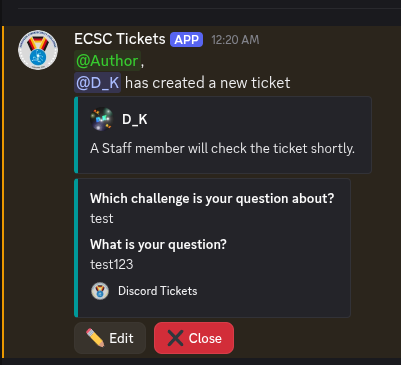
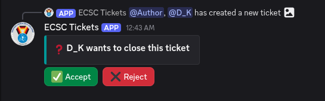
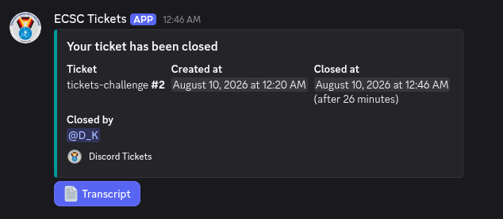
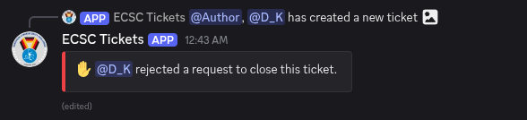

## 9.1 Authentication system

We are using a single authentication provider shared between all services for the ECSC.

By following the instructions in this section, users will be able to authenticate and gain access to proper Discord roles, channels and services.

The authentication is done via Authentik via this link <https://authentik.ecsc2026.de/if/flow/discord-flow/>.


1. The user should visit the authentication system via <https://authentik.ecsc2026.de/if/flow/discord-flow/>.
2. The user will be redirected to Discord to login there and redirected back to Authentik.
3. An Invitation Code form will appear and the user should enter the token they have received from their team's Point of Contact or from organizers. Multiple tokens can be entered comma separated.

   An example token looks like this:

   ```
   d0faf0cc-d37b-4fe6-a266-077be3c0df82
   ```

   After entering the token in the form, press the blue "Continue" button.

   \
   

   \
4. On successful authentication you will be able to confirm the roles you are trying to authenticate. 

   If these are the roles you expected, press the “Continue” button.

   \
   

   \
   In case the token is invalid, please check for typos and check with your team's Point of Contact. If needed, please contact the organizers.
5. Lastly you can change your username and set your password for your account, so you have a backup login mechanism.

   We strongly recommend you add a email address, this way we can contact you directly in case of emergencies.

   

In the case something is not working, please re-try in a couple of minutes. In case of further problems, please contact the organizers.


You can change your password, email address at a later point in the user settings of Authentik. You can also redeem more tokens after registration.

## 9.2. Jeopardy platform

The Jeopardy platform will serve as the central hub for all participants during the competition. It provides access to the challenges and displays the live scoreboard, allowing players to track their progress throughout the first day.

During the competition the Jeopardy platform will be available at: <https://play.ecsc2026.de/>

Teams are strongly encouraged to register and test their access on the platform during the Setup Time.

The following subsections describe various subpages of the Jeopardy Platform.

### 9.2.1. `/tasks`

List of all available challenges, including selected information about the challenge, such as:

* Name of the challenge.
* Current worth in points.
* Status of the challenge.
* Category of the challenge.

### 9.2.2. `/challenge/<challenge_name>`

This page provides all details of the given challenge, including its description, current solve count and point value.

It also provides following functionality:

* Flag submission form (use it to score points).
* Uploading write-ups.
* Start a challenge session

### 9.2.3. `/scoreboard`

This page shows current team rankings and lists solved challenges for each team.

Scoreboard by default shows only official teams, but has a feature to show all teams, i.e. official teams and guest teams.

Unlike in previous years, the scoreboard will not be frozen at the end of Day 1 this year. This said, please be mindful that the scoreboard might not be final and that submitting writeups for solved challenges is required.

### 9.2.4. `/feed`

Shows history of all challenge solves.

### 9.2.5. `/sessions`

Shows your teams active challenge sessions.

You can terminate them here as well.

## 9.3. Discord server

### 9.3.1. Ticketing system

The ticketing system enables participants to submit support requests to the organizers. It may be used for filing formal complaints, reporting issues related to the stability or functionality of challenges and services, and addressing general or platform-related matters.

For all technical docs visit:

* <https://discordtickets.app/>
* <https://zammad.org/documentation>

This section explains how to use the system from both the participants' and the support staff's perspectives.

The ticketing system is implemented using the "Discord-Tickets Bot", which provides an efficient method for managing user requests during the competition, additionally we setup Zammad with a bridge, bridging both. 

### 9.3.2. Teams' manual

This section of the manual describes the usage of the Ticket Tool bot for participants of the competition, including players, captains, and coaches.

The interface of the ticketing system is provided in the form of a Discord channel `#create-a-ticket`.

Another way to create tickets is by using Zammad and writing a mail to `<category>@ecsc2026.de`.

The interface is visible to everyone.

 

The ticket panel contains several buttons, each corresponding to a specific ticket category. The categories are briefly described below.

**Tickets General category:**

| Name | Description | Who can open ticket? | Who has access? |
|------|-------------|----------------------|-----------------|
| general | general questions, that may not fit any other category | everyone             | Staff, Jury     |
| formal | related to complaints, policies questions | ENISA, Jury, Steering Committee, Captain, Coaches | Staff, Jury     |
| challenge | related to challenges | Player               | Staff, Author, Jury |
| emergency | the type of a ticket related to "emergency" questions, in case of urgent emergencies, please first contact staff on site! | everyone             | Staff, Jury     |
| Press / Communications | Contact Comms about press visits, interviews, photo/video or press-angel support. | everyone             | Staff,  Press Room Managers ,Jury |

Emergencies category is for emergency tickets only.

### 9.3.3. Ticket creation and lifecycle

The ticket lifecycle proceeds through the following stages:

* **Pre-ticket creation** - User clicks a ticket create button and inputs broad information about the purpose of the ticket.
* **Ticket-specific channel** - The ticket exists and can be commented on by the creator and everyone who has access to the specific category of ticket.
* **Transcript** - visible only to support staff and the ticket creator.

The following guideline is the same for any type of tickets (emergency included).


1. The user should click the button for the type of a ticket that they want to create/open, e.g., "🧩tickets-challenge" button. On success a message form appears.
2. The message form helps the Staff to quickly figure out the problem without waiting for the first message.

   

   On success a success message appears

   
3. Newly created ticket - `#ticket-2` in this case - is actually a Discord channel that the user will see in the 🧩 tickets-challenge category upon creation. This temporary ticket channel is only visible to the ticket owner which is the user in this case and the support team.
4. The ticket channel will contain a "Welcome message". The user can write to the ticket as long as it’s open. The user should respond to any further questions

   
5. The user has an option to "Close" the ticket and so does the support team. The user might want to close the ticket in case its opening was not intentional (e.g. a misclick) or the issue was resolved. When the user or a support staff member clicks on the "Close" button, the other party has to confirm.

   
6. By clicking the green “Accept” button the ticket will be closed and the channel will be deleted and a transcript will be send to the user via private message obtainable via the “Transcript” button.

   
7. The user can also reject the ticket closing by clicking the "Reject" button. This means that the ticket stays open until the problem is resolved.

   

### 9.3.4. Channels and Categories

This section describes the organization of the ECSC2026 Discord Server categories and its channels. All channels are textual.

Notes:

* The `Discord Admin` role has read-write access to every channel. This role is limited to only few Staff members.
* There are multiple announcement channels that will be used for various purposes - please monitor all of them.
* The list is a non exhaustive list and only covers the main channels used during the event.

The channels and categories are:

| Category | Channel Name | Write Access | Read Access |
|----------|--------------|--------------|-------------|
| NONE     | rules        | Staff        | everyone    |
| NONE     | create-a-ticket |              | everyone    |
| ECSC-Players | 📢-players-announcement | Staff        | Jury, Player, Coach, Watchdog, ENISA, Author |
| ECSC-Players | <COUNTRY>-players | Staff, <COUNTRY>-player | Jury        |
| Captains-Coaches | 📢-coaches-announcement | Staff, AD Staff | Jury, Coach, Captain, Watchdog, Author |
| Captains-Coaches | captains-coaches-comms | Staff, Coach, Captain, Watchdog, Author | Jury        |
| Captains-Coaches | meeting-requests | Staff, Coach, Captain, Watchdog, Author | Jury        |
| Steering-Committee | 📢-sc-announcement | Staff        | Jury, Steering Committee |
| Steering-Committee | 🛞-general   | Staff, Steering Committee | Jury        |
| Watchdogs | 🐶-general   | Staff, Watchdog | Jury        |
| Angels   | 😇-general   | Staff, Angel | Jury        |
| Jury     | ⚖️-general   | Staff, Jury  |             |
| Authors  | 🧩-general   | Staff, Author |             |
| ECSC-Public | 📢-announcements | Staff        | everyone    |
| ECSC-Public | social-feeds | Staff        | everyone    |
| ECSC-Public | general      | everyone     |             |
| ECSC-Public | memes        | everyone     |             |
| ECSC-Public | random       | everyone     |             |
| ECSC-Public | spam         | everyone     |             |
| ECSC-Jeopardy | 📢-announcement-jeopardy | Staff        | Jury, Author, Player, Watchdog |
| ECSC-Jeopardy | general-jeopardy | Staff, Author, Player, Watchdog | Jury        |
| ECSC-AD  | 📢-announcement-ad | Staff, AD Staff | Jury, Author, Player, Watchdog |
| ECSC-AD  | general-ad   | Staff, Author, Player, Watchdog | Jury        |

### 9.3.5. Discord Roles

This section is describing all important Discord roles that exist on ECSC2026 Discord Server.

* Captain
* Captain <COUNTRY>
* Player
* Player <COUNTRY>
* <COUNTRY>
* Coach
* Coach <COUNTRY>
* Steering Committee
* Jury
* Watchdog Manager
* Watchdog
* Angel Manager
* Angel
* Ticket Manager
* Staff
* Admin
* ENISA
* Author
* Jeopardy Author
* AD Staff

Roles like: captain, coach, country, ticket-manager can be mapped to multiple role sets - they are sort of role "tags". For more information, see Role sets section.

Please note that a Staff member might have multiple roles, including multiple extra case-specific roles if needed.

### 9.3.6. Role sets

This part is explaining the role sets for the roles in the way they are organized on ECSC2026 Discord Server.

| Role set name | Discord roles |
|---------------|---------------|
| Captain       | captain, player, player-country, country, captain-country |
| Coach         | coach, coach-country, country |
| Player        | player, player-country, country |
| Watchdog Manager | watchdog-manager, watchdog |
| Angel Manager | angel-manager, angel |
| Jeopardy Author | Jeopardy Author, Author |
| AD Staff      | AD Staff, Author |